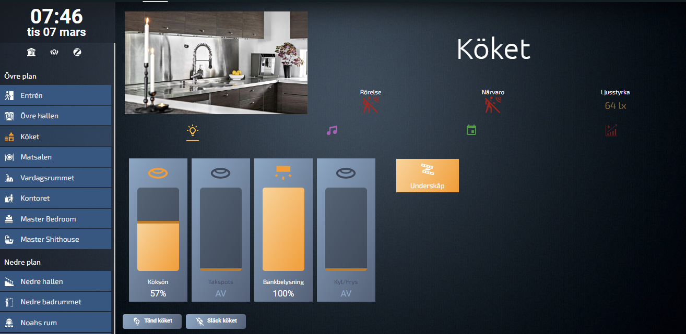

<picture>
  
</picture>

# Aleborg Frontend

This is a complete frontend for [HomeAssistant](https://home-assistant.io)\
It automatically shows lights, multimedia, calendars and power usage for all areas(rooms), you only have to configure what areas to show in one file, settings.yaml.

I've tried to make this frontend as automated as possible. Due to restrictions in the frontend, a lot of things needs to be configured in the file [/includes/lovelace/aleborg_frontend/settings.yaml](settings.md).

This frontend doesn't have support for all types of devices and entities due to the fact that I don't have all different devices, such as covers. [A list of my hardware can be found here](hardware.md).

There's still a lot to do in this frontend and my CSS skills sucks, so all contribution is welcome! 

Have you install it? I would love to get some feedback! 


<a href="https://www.buymeacoffee.com/aleborg"></a>

## Table of Content <!-- omit in toc -->
- [Aleborg Frontend](#aleborg-frontend)
  - [CHANGELOG](#changelog)
  - [Updates](#updates)
  - [Requirements](#requirements)
    - [Frontend (HACS)](#frontend-hacs)
    - [Integrations (HACS)](#integrations-hacs)
  - [Installation](#installation)
  - [configuration.yaml](#configurationyaml)
    - [Lovelace configuration](#lovelace-configuration)
    - [Theme configuration](#theme-configuration)
  - [Resources](#resources)
  - [Settings](#settings)
    - [/includes/lovelace/aleborg\_frontend/settings.yaml](#includeslovelacealeborg_frontendsettingsyaml)
  - [Folders and descriptions of files](#folders-and-descriptions-of-files)
    - [/includes/lovelace/aleborg\_frontend/common](#includeslovelacealeborg_frontendcommon)
    - [/includes/lovelace/aleborg\_frontend/templates](#includeslovelacealeborg_frontendtemplates)
    - [/includes/lovelace/aleborg\_frontend/views](#includeslovelacealeborg_frontendviews)
  - [Screenshots](#screenshots)
    - [Home](#home)
    - [All lights](#all-lights)
    - [Lights in a room](#lights-in-a-room)
    - [Multimedia in a room](#multimedia-in-a-room)
    - [Calendar in a room](#calendar-in-a-room)
    - [Power usage in a room](#power-usage-in-a-room)

## CHANGELOG

Read the latest [changelog here](changelog.md)! 

## Updates
When updating the dashboard, please be aware that the settings.yaml can be overwritten if you're not careful. Compare your current settings.yaml to the new to see what have changed!

## Requirements

### Frontend (HACS)
<sub>If you choose to remove a component, you'll also have to remove the code that uses that component throughout the code.</sub>
<sub>Sadly I had to use a lot of different components to automate this dashboard, hopefully I'll be able to minimize the amount in the future.</sub>

* **[layout-card](https://github.com/thomasloven/lovelace-layout-card)** by [@thomasloven](https://github.com/thomasloven/)\
  <sub>Used throughout the code for the design</sub>
* **[auto-entities](https://github.com/thomasloven/lovelace-auto-entities)** by [@thomasloven](https://github.com/thomasloven/)\
  <sub>Used throughout the code to automatically find entities in the different areas</sub>
* **[card-mod 3](https://github.com/thomasloven/lovelace-card-mod)** by [@thomasloven](https://github.com/thomasloven/)\
  <sub>Used throughout the code to style the cards using CSS, all CSS values can be changed in [aleborg-material.yaml](includes/lovelace/aleborg_frontend/common/aleborg-material.yaml)</sub>
* **[state-switch](https://github.com/thomasloven/lovelace-state-switch)** by [@thomasloven](https://github.com/thomasloven/)\
  <sub>Used in the [media_player_card.yaml](includes/lovelace/aleborg_frontend/templates/partials/media/media_player/media_player_card.yaml) to display the correct media player choosen in source of an receiver</sub>
* **[Button Card](https://github.com/custom-cards/button-card)** by [@RomRider](https://github.com/RomRider)\
  <sub>Used throughout the code for statistics and lights</sub>
* **[ApexCharts Card](https://github.com/RomRider/apexcharts-card)** by [@RomRider](https://github.com/RomRider)\
  <sub>Used in [home.yaml](includes/lovelace/aleborg_frontend/views/home.yaml) to display the graph for electrical prices. **Can be removed**</sub>
* **[Config Template Card Card](https://github.com/iantrich/config-template-card)** by [@iantrich](https://github.com/iantrich)\
  <sub>Used in the [media_player_card.yaml](includes/lovelace/aleborg_frontend/templates/partials/media/media_player/media_player_card.yaml) to display the correct media player choosen in source of an receiver (in combination with the component state-switch)</sub>
* **[Digital Clock](https://github.com/wassy92x/lovelace-digital-clock)** by [@wassy92x](https://github.com/wassy92x)\
  <sub>Displays the clock in the sidebar. **Can be removed**</sub>
* **[HA Dashboard](https://github.com/wassy92x/lovelace-ha-dashboard)** by [@wassy92x](https://github.com/wassy92x)\
  <sub>This component makes it possible to use the sidebar with the menu</sub>
* **[Vertical Stack In Card](https://github.com/ofekashery/vertical-stack-in-card)** by [@ofekashery](https://github.com/ofekashery)\
  <sub>Used throughout the code for the design</sub>
* **[Mini Media Player](https://github.com/kalkih/mini-media-player)** by [@kalkih](https://github.com/kalkih)\
  <sub>Used for all Media Players. **Can be removed if you remove all media player code**</sub>
* **[Sonos card for Home Assistant's Dashboard UI](https://github.com/johanfrick/custom-sonos-card)** by [@johanfrick](https://github.com/johanfrick)\
  <sub>Shows the control for Sonos integration **Can be removed and replaced with a regular media player**</sub>
* **[Mushroom](https://github.com/piitaya/lovelace-mushroom)** by [@piitaya](https://github.com/piitaya)\
  <sub>Used throughout the code for the design</sub>
* **[Mushroom Themes](https://github.com/piitaya/lovelace-mushroom-themes)** by [@piitaya](https://github.com/piitaya)\
  <sub>Used throughout the code for the design</sub>
* **[Kiosk Mode](https://github.com/NemesisRE/kiosk-mode)** by [@NemesisRE](https://github.com/NemesisRE)\
  <sub>Displays the dashboard without menu. **Can be removed**</sub>
* **[Home Assistant Swipe Navigation](https://github.com/zanna-37/hass-swipe-navigation)** by [@zanna-37](https://github.com/zanna-37)\
  <sub>Makes it possible to swipe between the pages. **Can be removed**</sub>
* **[Tabbed Card](https://github.com/kinghat/tabbed-card)** by [@kinghat](https://github.com/kinghat)\
  <sub>Makes it possible to have the tabs(icons) that allows us to display lights, media etc in each room/area </sub>

### Integrations (HACS)
* **[lovelace_gen](https://github.com/thomasloven/hass-lovelace_gen)** by [@thomasloven](https://github.com/thomasloven/)\
  <sub>This is what makes the magic happen, along side with auto-entities and Variable</sub>
* **[fontawesome](https://github.com/thomasloven/hass-fontawesome)** by [@thomasloven](https://github.com/thomasloven/)\
  <sub>Is used for all custom icons that is used. **Can be removed if you replace all icons in [settings.yaml](includes/lovelace/aleborg_frontend/settings.yaml)**</sub>
* **[Nord Pool integration for Home Assistant](https://github.com/custom-components/nordpool)** by [@custom-components](https://github.com/custom-components)\
  <sub>Fetches electric prices in [home.yaml](includes/lovelace/aleborg_frontend/views/home.yaml). **Can be removed**</sub>

## Installation

1. Make sure all the Frontend plugins and Integrations are installed in HACS.
2. Edit HomeAssistants [configuration.yaml](#configurationyaml) file. 
3. Copy all folders and files into your config folder in HomeAssistant
4. Configure [includes/lovelace/aleborg_frontend/settings.yaml](settings.md) for your own needs.
5. Restart HomeAssistant
6. Report any bugs...

## configuration.yaml
These are changes that you need to make after you've installed all plugins.

### Lovelace configuration
Add to your `configuration.yaml` these lines:
```yaml
#########################################################
# Lovelace                                              #
#########################################################
lovelace_gen:
  tablet: !include includes/lovelace/aleborg_frontend/settings.yaml

lovelace:
  dashboards:
    lovelace-aleborg: # Needs to contain a hyphen (-)
      mode: yaml
      filename: includes/lovelace/aleborg_frontend/tablet.yaml # or the path to where you added the folder
      title: Aleborg Frontend
      icon: mdi:tools
      show_in_sidebar: true
      require_admin: false
```
### Theme configuration
Included is a custom theme, it's placed in the directory `config/themes`, if it don't exist create it and add the following to your `configuration.yaml`

```yaml
#########################################################
# Themes                                                #
#########################################################
frontend:
  themes: !include_dir_merge_named themes
```

## Resources
Add following resource in ***`Settings -> Dashboards`***, click on the three dots in the upper right corner and choose ***`Resources`***, click on ***`+ ADD RESOURCE`*** in the lower right corner.

```
URL: https://fonts.googleapis.com/css2?family=Exo+2:ital,wght@0,300;0,400;0,500;0,700;1,300;1,400;1,500;1,700&family=Ubuntu:ital,wght@0,300;0,400;0,500;0,700;1,300;1,400;1,500;1,700&display=swap
Resource type: Stylesheet
```
## Settings

All configuration options for this frontend is defined here:

### [/includes/lovelace/aleborg_frontend/settings.yaml](settings.md)

## Folders and descriptions of files

### [/includes/lovelace/aleborg_frontend/common](/includes/lovelace/aleborg_frontend/common/readme.md)

### [/includes/lovelace/aleborg_frontend/templates](/includes/lovelace/aleborg_frontend/templates/readme.md)

### [/includes/lovelace/aleborg_frontend/views](/includes/lovelace/aleborg_frontend/views/readme.md)

## Screenshots
### Home

### All lights

### Lights in a room

### Multimedia in a room

### Calendar in a room

### Power usage in a room

