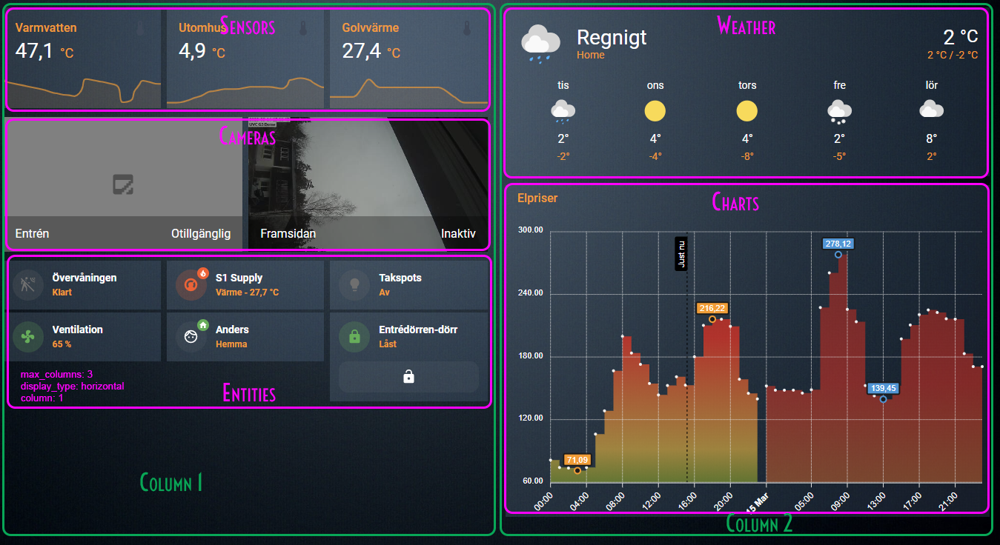

# Configuration - settings.yaml <!-- omit in toc -->

## Table of Content <!-- omit in toc -->
- [Overview](#overview)
- [Settings](#settings)
  - [Options](#options)
  - [Header](#header)
    - [Example](#example)
  - [Tabs](#tabs)
    - [Example](#example-1)
  - [Exclude entities](#exclude-entities)
    - [Example](#example-2)
  - [Translations](#translations)
    - [Example](#example-3)
  - [Power consumption segments](#power-consumption-segments)
    - [Example](#example-4)
- [Start page](#start-page)
    - [Example](#example-5)
  - [Parts](#parts)
    - [Example](#example-6)
    - [Types](#types)
      - [`sensors`](#sensors)
    - [Example](#example-7)
      - [`weather`](#weather)
    - [Example](#example-8)
      - [`cameras`](#cameras)
    - [Example](#example-9)
      - [`charts`](#charts)
    - [Example](#example-10)
      - [`entities`](#entities)
    - [Example](#example-11)
- [Rooms and pages](#rooms-and-pages)
    - [Shortcuts (below the clock in the sidebar)](#shortcuts-below-the-clock-in-the-sidebar)
      - [Example](#example-12)
    - [Floors / Subjects in the menu](#floors--subjects-in-the-menu)
      - [Example](#example-13)
    - [Rooms](#rooms)
      - [Example](#example-14)
- [Full example](#full-example)


## Overview

| Name            | Type      | Optional/Required | Description            |
|:----------------|:---------:|:-----------------:|:-----------------------|
| `settings`      | object    | Required          | See [Settings](#settings)  |
| `startPage`     | object    | Required          | See [Start page](#start-page)  |
| `rooms`         | object    | Required          | See [Rooms and pages](#rooms-and-pages)  |


## Settings
This is where the global settings such as global variables, translations, excluded entities etc. are configured
To all parts new items can be added.

:warning: <sub>After making changes in settings.yaml you'll need to restart HomeAssistant</sub>
### Options
| Name            | Type      | Optional/Required | Description            |
|:----------------|:---------:|:-----------------:|:-----------------------|
| `theme`         | string    | Required          | Name of the theme to use  |
| `dashboardPath` | string    | Required          | URL/Path to this dashboard, same as the name in `configuration.yaml` below `lovelace:` -> `dashboards:`  |
| `header`        | object    | Required          | See [Header](#header)  |
| `tabs`          | object    | Required          | See [Tabs](#tabs)  |
| `excludeEntities`| object   | Required          | See [Exclude entities](#exclude-entities)  |
| `translations`  | object    | Required          | See [Translations](#translations)  |
| `powerConsumptions`| object | Optional          | See [Power consumption segments](#power-consumption-segments)  |


### Header
This is used for the home/intro page, if you don't use the included `views/home.yaml` then this section can be removed.

| Name            | Type      | Optional/Required | Description            |
|:----------------|:---------:|:-----------------:|:-----------------------|
| `showTemperatureSensors` | boolean | Required   | Name of the theme to use  |
| `showHumiditySensors`    | boolean | Required   | Name of the theme to use  |
| `showMotionSensors`      | boolean | Required   | Name of the theme to use  |
| `showPrecenceSensors`    | boolean | Required   | Name of the theme to use  |
| `showIlluminanceSensors` | boolean | Required   | Name of the theme to use  |

#### Example

```yaml
settings: 
  ...
  header: 
      showTemperatureSensors: true
      showHumiditySensors: true
      showMotionSensors: false
      showPrecenceSensors: true
      showIlluminanceSensors: true
```

### Tabs
Here you can choose what tabs that should be visible and what icons the tabs should have.

| Name            | Type      | Optional/Required | Description            |
|:----------------|:---------:|:-----------------:|:-----------------------|
| `showLights`    | boolean   | Required          | Show or hide the lights tab  |
| `lightsIcon`    | string    | Required          | What icon to use for the lights tab  |
| `showMedia`     | boolean   | Required          | Show or hide the media tab  |
| `mediaIcon`     | string    | Required          | What icon to use for the media tab  |
| `showCalendar`  | boolean   | Required          | Show or hide the calendar tab  |
| `calendarIcon`  | string    | Required          | What icon to use for the calendar tab  |
| `showPower`     | boolean   | Required          | Show or hide the power usage tab  |
| `powerIcon`     | string    | Required          | What icon to use for the power usage tab  |

#### Example

```yaml
settings: 
  ...
  tabs:
    showLights: true
    lightsIcon: mdi:lightbulb-on-10
    showMedia: true
    mediaIcon: mdi:music
    showCalendar: true
    calendarIcon: mdi:calendar
    showPower: true
    powerIcon: fapro:usage
```

### Exclude entities
Here you can exclude entities, states and hidden entities that you don't want to be shown in the rooms/pages.\
You can do this for lights, media, scenes, the page header and for the power usage.\
You can read more about the filters here: **[auto-entities](https://github.com/thomasloven/lovelace-auto-entities)** by [@thomasloven](https://github.com/thomasloven/)

| Name            | Type      | Optional/Required | Description            |
|:----------------|:---------:|:-----------------:|:-----------------------|
| `entities`      | list      | Optional          | Entities  |
| `state`         | list      | Required          | Name of the theme to use  |
| `hidden_by`     | list      | Optional          | Name of the theme to use  |

#### Example

```yaml
settings: 
  ...
  excludeEntities: 
      lights: 
        entities: 
          - "switch.sp001_switch_power_monitor_belysning_koket"
          - "switch.wifi_plug_4_socket_1"
        state: 
          - "unavailable"
          - "unknown"     
        hidden_by: 
          - "user"
          - "integration"

      media:
        entities:
          - "media_player.sonos*" 
        state:
          - "unknown"
        hidden_by: 
          - "user"
          - "integration"

      page_header:
        state:
          - "unavailable"
          - "unknown"
        hidden_by: 
          - "user"
          - "integration"

      power_usage:
        state:
          - "unavailable"
          - "unknown"
        hidden_by: 
          - "user"
          - "integration"
      scenes:
        state:
          - "unavailable"
          - "unknown"
        hidden_by: 
          - "user"
          - "integration"
```

### Translations

You can easily add translations if you need it somewhere. The page need to start with `# lovelace_gen`.
The translations can be referenced with this code: `{{_global.tablet.settings.translations.power.powerConsumptionNow}}`

:warning: <sub>Removing any of the `powerConsumption` will also remove those gauges from the pages.\
In other words, if we remove i.e. `powerConsumptionYear` from translations, will cause all gauges with power consumption for the past year to be removed from all pages. </sub>

#### Example

```yaml
settings: 
  ...
  translations: 
    "OFF": "Off"
    power:
      powerConsumptionNow: "Current consumption"
      powerConsumptionToday: "Consumption today"
      powerConsumptionWeek: "Consumption past week"
      powerConsumptionMonth: "Consumption past month"
      powerConsumptionYear: "Consumption past year"
    home:
      apexCardElectricityPrices: "kWh Price"
      apexCardRightNow: "Now"
```

### Power consumption segments
The power consumption is shown in W and kWh, depending on your consumption you might want to change this so that the gauges don't end up on max or minimum with the needle. The segments currently exists in the segments from 0 to 10, 20, 30, 40, 50, 60, 70, 80, 90 and 100  

| Name            | Type      | Optional/Required | Measured in | Description            |
|:----------------|:---------:|:-----------------:|:-----------:|:-----------------------|
| `maxSegmentCurrent` | int   | Required          | W           | Current consumption |
| `maxSegmentDaily`   | int   | Required          | kWh         | Consumption today  |
| `maxSegmentWeekly`  | int   | Required          | kWh         | Consumption past week  |
| `maxSegmentMonthly` | int   | Required          | kWh         | Consumption past month  |
| `maxSegmentYearly`  | int   | Required          | kWh         | Consumption past year |

#### Example

```yaml
settings: 
  ...
  powerConsumptions:
    maxSegmentCurrent: 100
    maxSegmentDaily: 40
    maxSegmentWeekly: 20
    maxSegmentMonthly: 20
    maxSegmentYearly: 60
```

## Start page
These are the settings for the start page for the dashboard. 

| Name            | Type      | Optional/Required | Description            |
|:----------------|:---------:|:-----------------:|:-----------------------|
| `title`         | string    | Required          | Title of the start page  |
| `icon`          | string    | Required          | The icon for the start page, i.e. `mdi:home` |
| `display_type`  | string    | Required          | How the start page should be displayed. Supported options are `horizontal`, `vertical`, `grid` and `masonry`  |
| `max_columns`   | integer   | Required          | The amount of columns to display  |
| `parts`         | array     | Required          | What parts to display, see [Parts](#parts)  |




#### Example

```yaml
startPage:
  title: "Home"
  icon: "mdi:home"
  display_type: horizontal
  max_columns: 2
  parts:
    ...
```

### Parts
This is where you configure all the parts you want to show on the start page.

Each part has the following options: 

| Name            | Type      | Optional/Required | Description            |
|:----------------|:---------:|:-----------------:|:-----------------------|
| `type`          | string    | Required          | Supported options are [sensors](#sensors), [weather](#weather), [cameras](#cameras)], [charts](#charts) and [entities](#entities) |
| `sortOrder`     | integer   | Required          | Specifies the order of the type in the start page | 
| `display_type`  | string    | Required          | How the start page should be displayed. Supported options are `horizontal`, `vertical`, `grid` and `masonry`  |
| `column`        | integer   | Required          | Specifies the column that the part should be shown in |
| `max_columns`   | integer   | Required          | Maximum columns that the part can have  |
| `min_width`     | integer   | Required          | Minimum width of each entity, in px   |
| `max_width`     | integer   | Required          | Maximum width of each entity, in px  |
| `hideOnMobile`  | boolean   | Optional          | Specifies if the part should be visible on mobile units (max width 480px)  |
| `entities`      | array     | Required          | An array of entities to be shown in the part  |

#### Example

```yaml
  - type: sensors
    sortOrder: 0
    display_type: horizontal
    column: 1
    max_columns: 10
    min_width: 175
    max_width: 1000
    hideOnMobile: false
    entities:
      ...
  - type: weather
    sortOrder: 1
    display_type: vertical
    column: 2
    max_columns: 10
    min_width: 175
    max_width: 1000
    entities:
      ...
```

#### Types
Each type can be used more than once, all entities in the part will be grouped together. 

##### `sensors`
This part uses the [Sensor Card](https://www.home-assistant.io/dashboards/sensor/). All configuration variables from the card can be used.

#### Example

```yaml
  - entity_id: sensor.nibe_23270_40014
    sortOrder: 0
    name: "Hotwater"
    detail: 2
    graph: line
    hours_to_show: 24
```

##### `weather`
This part uses the [Weather Forecast Card](https://www.home-assistant.io/dashboards/weather-forecast/). All configuration variables from the card can be used.

#### Example

```yaml
  - entity_id: weather.smhi_home
    sortOrder: 0
    show_current: true
    show_forecast: true
```

##### `cameras`
This part uses the [Picture Entity Card](https://www.home-assistant.io/dashboards/picture-entity/). All configuration variables from the card can be used.
#### Example

```yaml
  - entity_id: camera.security_camera
    sortOrder: 0
    name: "Entrén"
    show_state: true
    show_name: true
```

##### `charts`
This chart shows the power costs chart. It will only be displayed if [`powerConsumptions`](#power-consumption-segments) is specified in the settings.

#### Example

```yaml
  - entity_id: sensor.nordpool_kwh_se3_sek_3_10_025
    sortOrder: 0
    hours_12: false
    graph_span: 48h
```

##### `entities`

The entities type uses the [Mushroom Cards](https://github.com/piitaya/lovelace-mushroom#cards) to display entities. All the mushroom settings for each card can be used here, See the links for each `type` for the settings for each card.

| Name            | Type      | Optional/Required | Description            |
|:----------------|:---------:|:-----------------:|:-----------------------|
| `entity_id`     | string    | Required          | ID of the entity to show  |
| `sortOrder`     | integer   | Required          | Specifies the order of the card in the part | 
| `type`          | string    | Required          | Type of card that should be used. Supported options are [climate](https://github.com/piitaya/lovelace-mushroom/blob/main/docs/cards/climate.md), [light](https://github.com/piitaya/lovelace-mushroom/blob/main/docs/cards/light.md), [fan](https://github.com/piitaya/lovelace-mushroom/blob/main/docs/cards/fan.md), [humidifier](https://github.com/piitaya/lovelace-mushroom/blob/main/docs/cards/humidifier.md), [media-player](https://github.com/piitaya/lovelace-mushroom/blob/main/docs/cards/media-player.md), [vacuum](https://github.com/piitaya/lovelace-mushroom/blob/main/docs/cards/vacuum.md), [cover](https://github.com/piitaya/lovelace-mushroom/blob/main/docs/cards/cover.md) [alarm-control-panel](https://github.com/piitaya/lovelace-mushroom/blob/main/docs/cards/alarm-control-panel.md), [person](https://github.com/piitaya/lovelace-mushroom/blob/main/docs/cards/person.md), [lock](https://github.com/piitaya/lovelace-mushroom/blob/main/docs/cards/lock.md), [entity](https://github.com/piitaya/lovelace-mushroom/blob/main/docs/cards/entity.md) |


#### Example

```yaml
  - entity_id: light.dm011_belysning_takspots_nedre_badrummet
    sortOrder: 2
    type: light
    collapsible_controls: true
    show_brightness_control: true
    tap_action: 
      action: none
    hold_action: 
      action: none
    double_tap_action: 
      action: none
```


## Rooms and pages
This is where you configure the rooms

#### Shortcuts (below the clock in the sidebar)

<sub>:warning: Shortcuts will only display the icon</sub>

| Name            | Type      | Optional/Required | Description            |
|:----------------|:---------:|:-----------------:|:-----------------------|
| `title`         | string    | Required          | The name of the room/page, displayed in the sidebar and in the top of the page. |
| `url`           | string    | Required          | URL/Path in the browser for the page, should only be one word, i.e. `myroom`, can also contain hypens `my-room` |
| `icon`          | string    | Required          | The icon to use, i.e. `mdi:home` |
| `isShortcut`    | boolean   | Required          | Set this to `true` | 
| `file`          | string    | Optional          | Use _file_ to point the page to a custom file that exists in the folder _[views](../views/readme.md)_ |
| `sortOrder`     | int       | Required          | Specifies the order of the room in the menu | 

##### Example
```yaml
rooms:
  ...
  - title: "Hem"
    url: "home"
    file: "home.yaml"
    icon: "mdi:home"
    isShortcut: true
    sortOrder: 0
```

#### Floors / Subjects in the menu
| Name            | Type      | Optional/Required | Description            |
|:----------------|:---------:|:-----------------:|:-----------------------|
| `title`         | string    | Required          | The title of the floor |
| `sortOrder`     | int       | Required          | Specifies the order of the room in the menu | 

##### Example
```yaml
rooms:
  ...
  - title: "Upper floor"
    sortOrder: 3
```

#### Rooms


| Name            | Type      | Optional/Required | Description            |
|:----------------|:---------:|:-----------------:|:-----------------------|
| `title`         | string    | Required          | The name of the room/page, displayed in the sidebar and in the top of the page. <sub>:warning: Needs to be exactly the same as the area name!</sub> |
| `areaId`        | string    | Required          | ID of the area. <sub>:warning: Needs to be exactly the same as the area-id!</sub> |
| `icon`          | string    | Required          | The icon to use, i.e. `mdi:home` |
| `sortOrder`     | int       | Required          | Specifies the order of the room in the menu | 

##### Example
```yaml
rooms:
  ...
  - title: "Entrance" 
    areaId: "entrance"
    icon: "mdi:door-open"
    sortOrder: 9
```

## Full example
[Can be found here.](includes/lovelace/aleborg_frontend/settings.yaml))